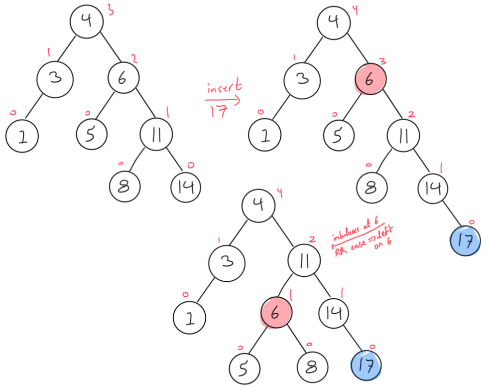

# AVL Trees

AVL trees use the following node definition:

```c
struct node {
    int data;
    int height;
    struct node *left;
    struct node *right;
};
```

1.   For the following AVL tree, annotate each node with the height of its subtree.

     

     Now starting from the initial tree each time, insert the following integers:

     ```
     0  2  10  17
     ```

     ### Solution

     Inserting 1:

     

     Inserting 2:

     

     Inserting 10:

     

     Inserting 17:

     

2.   Show how an AVL tree would be constructed if the following values were inserted into an initially empty tree in the order given:

     ```
     12  10  8  6  4  2
     ```

     ### Solution

     

3.   Using an AVL tree, design an algorithm to determine if an array contains two elements that sum to a given value.

     1.  Write the algorithm in pseudocode.

         ```pseudocode
         Input: array A of n ints, integer v
         Output: true if A has two distinct elements that sum to v, false otherwise
         
         twoSum(A, v):
            t = new AVL tree
            
            for i from 0 to n - 1 do
                if t contains (v - A[i]) then
                    return true
                 insert A[i] into t
             
             return false
         ```

     2.  Analyse the time complexity of your algorithm.

         The loop does a linear pass through `A` and is hence $\mathcal{O}(n)$. Inside the loop, all operations are constant time except searching and inserting into the AVL tree, both of which are $\mathcal{O}(\log n)$ operations. So overall we have $\mathcal{O}(n \log n)$.