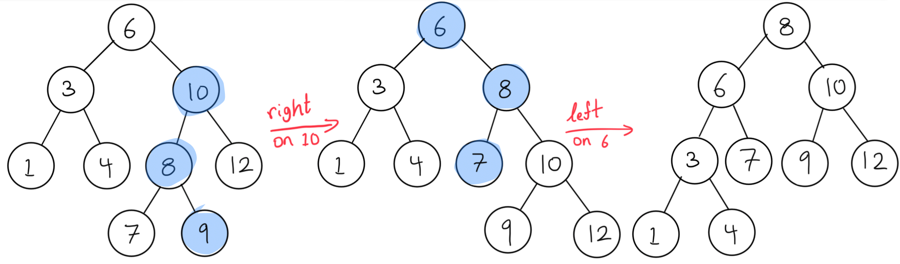
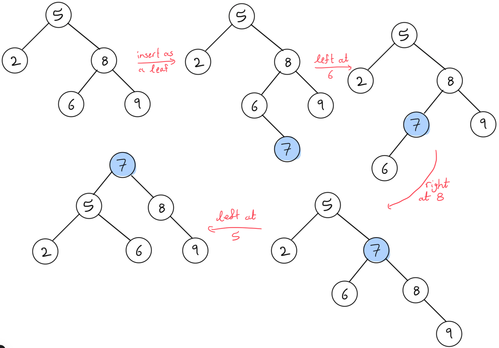

# Balancing Trees

1.   Show how the following tree would change if we do a right rotation on the node containing 10 followed by a left rotation on the node containing 6.

     

     ### Solution

     

2.   Show the result of performing the insert-at-root operation with the value 7 in this binary search tree:

     

     ### Solution

     