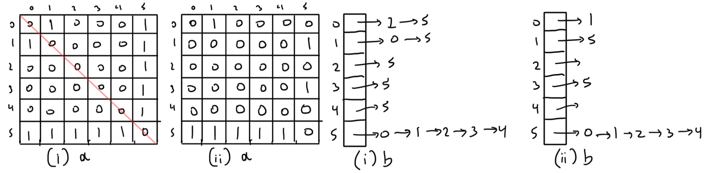

# Graph Representation

1.   Consider the following graph

     

     The edges are labelled simply for convenience in describing graph properties.

     1.   How many edges does it have? 11
     2.   How many *cycles* are there in the graph? 6
     3.   How many *cliques* are there in the graph? 2
     4.   What is the *degree* of each vertex? from vertex 0 to 8 ==> 2, 3, 3, 3, 2, 1, 1, 5, 2
     5.   How many edges in the *longest* path from 5 to 8? 7

2.   For each of the following graphs:

     

     Show the concrete data structures if the graph was implemented via:

     1.   adjacency matrix representation (assume a full 𝑉×𝑉 matrix)
     2.   adjacency list representation (if non-directional, include both (𝑣,𝑤) and (𝑤,𝑣)

     

3.   How is the adjacency matrix for a directed graph different to that for an undirected graph?

     An adjacency matrix for a undirected graph is symmetric. `matrix[x][y] == matrix[y][x]` for all $x$ and $y$. This isn't necessarily the case for directed graphs.

4.   Facebook could be considered as a giant "social graph"
     1.  What are the vertices? Facebook users
     2.  What are the edges? Friendships
     3.  Are edges directional? No, if person $x$ is friends with person $y$ then person $y$ is also friends with person $x$.
     4.  What does the degree of each vertex represent? How many friends the user has.
     5.  What kind of graph algorithm could suggest potential friends? Breadth-first search to find friends of friends, friends of friends of friends, and so on.