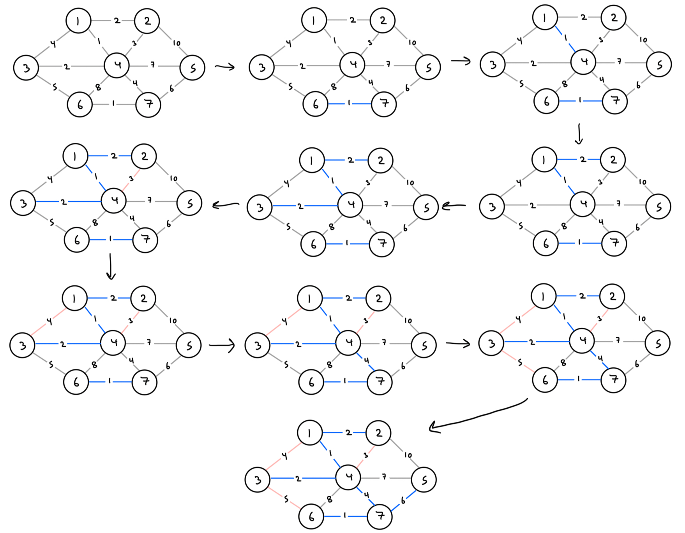
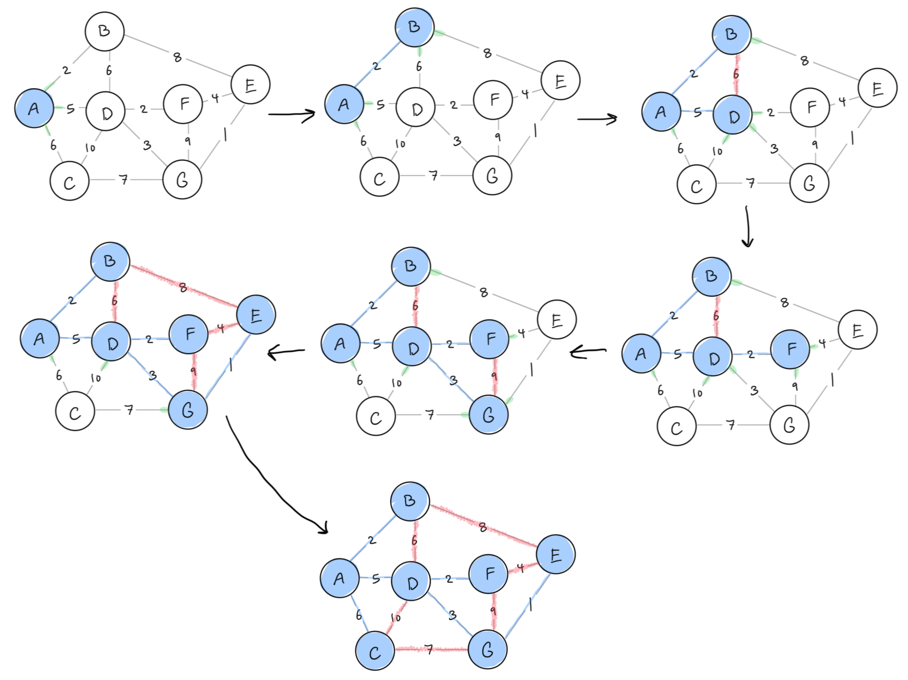

# Graphs (ii)

1.  In the following graph:

    

    1.  Which vertices are reachable from vertex 0? 1, 2, 3, 4, 5, 7, 8
    2.  Which vertices are reachable from vertex 1? None
    3.  Which vertices are reachable from vertex 5? 1
    4.  Which vertices are reachable from vertex 6? 0, 1, 2, 3, 4, 5, 7, 8, 9

2.  Write a C function that takes a Graph and a starting Vertex and returns a set containing all of the vertices that can be reached by following a path from the starting point. Use the function template:

    ```c
    Set reachable(Graph g, Vertex src) {
        Set s = SetNew();
        doDFS(g, src, s);
        return s;
    }
    
    static void doDFS(Graph g, Vertex v, Set seen) {
        SetAdd(seen, v);
    
        for (int w = 0; w < g->nV; w++) {
            if (g->edges[v][w] && !SetContains(seen, w))
            	doDFS(g, w, seen);
        }
    }
    ```

    You may use any of the standard ADTs from the slides (e.g. Sets, Lists, Stacks, Queues).

3.  Trace the execution of Dijkstra's algorithm on the following graph to compute the minimum distances from source node 0 to all other vertices:

    

    Show the values of `vSet`, `dist[]` and `pred[]` after each iteration.

    ### Answer

    Iteration 0:

    -   vSet = $\set{0, 1, 2, 3, 4, 5, 6, 7}$
    -   dist  = $[0, \infty, \infty, \infty, \infty, \infty, \infty, \infty]$
    -   pred = $[-1, -1, -1, -1, -1, -1, -1, -1]$​

    Iteration 1:

    -   vSet = $\set{1, 2, 3, 4, 5, 6, 7}$
    -   dist  = $[0, 5, 4, 6, \infty, \infty, \infty, \infty]$
    -   pred = $[-1, 0, 0, 0, -1, -1, -1, -1]$​

    Iteration 2:

    -   vSet = $\set{1, 3, 4, 5, 6, 7}$
    -   dist  = $[0, 5, 4, 5, 7, 11, \infty, \infty]$
    -   pred = $[-1, 0, 0, 2, 2, 2, -1, -1]$​

    Iteration 3:

    -   vSet = $\set{1, 4, 5, 6, 7}$
    -   dist  = $[0, 5, 4, 5, 7, 11, \infty, \infty]$
    -   pred = $[-1, 0, 0, 2, 2, 2, -1, -1]$​

    Iteration 4:

    -   vSet = $\set{4, 5, 6, 7}$
    -   dist  = $[0, 5, 4, 5, 7, 7, 12, \infty]$
    -   pred = $[-1, 0, 0, 2, 2, 1, 1, -1]$​

    Iteration 5:

    -   vSet = $\set{5, 6, 7}$
    -   dist  = $[0, 5, 4, 5, 7, 7, 12, 15]$
    -   pred = $[-1, 0, 0, 2, 2, 1, 1, 4]$​

    Iteration 6:

    -   vSet = $\set{6, 7}$
    -   dist  = $[0, 5, 4, 5, 7, 7, 10, 13]$
    -   pred = $[-1, 0, 0, 2, 2, 1, 5, 5]$​

    Iteration 7:

    -   vSet = $\set{7}$
    -   dist  = $[0, 5, 4, 5, 7, 7, 10, 13]$
    -   pred = $[-1, 0, 0, 2, 2, 1, 5, 5]$​

    Iteration 8:

    -   vSet = $\set{}$
    -   dist  = $[0, 5, 4, 5, 7, 7, 10, 13]$
    -   pred = $[-1, 0, 0, 2, 2, 1, 5, 5]$

4.  Kruskal's algorithm for finding a minimum spanning tree of a graph can be expressed as follows:

    ```c
    typedef Graph MSTree;
    
    MSTree kruskalFindMST(Graph g) {
        MSTree mst = GraphNew(g->nV); // MST initially empty
        Edge eList[g->nE]; // sorted array of edges
        edges(eList, g->nE, g);
        sortEdgeList(eList, g->nE);
        for (int i = 0; mst->nE < g->nV - 1; i++) {
            Edge e = eList[i];
            GraphAddEdge(mst, e);
            if (GraphHasCycle(mst)) GraphRemoveEdge(mst, e);
        }
        return mst;
    }
    ```

    This algorithm effectively constructs the MST by gradually joining together the connected graphs in a forest that starts with each subgraph being a single node. On each iteration, it add a new edge to the forest, and reduces the number of subgraphs by one. Show how it would construct the MST for the graph below:

    

    ### Answer

    

    How many edges did we have to consider?

    -   9

    For a graph $G(V,E)$​, what is the least number of edges we might need to consider?

    -   $V - 1$

    What is the most number of edges we might have to consider?

    -   $E$

    Add another edge to the above graph to force Kruskal's algorithm to the worst case.

    -   Insert a new vertex 8 and add an edge between it and any other vertex with edge weight $e > 10$.

5.  Prim's algorithm for finding a MST of a graph can be expressed abstractly as follows:

    1.  Start from any vertex *v* and empty MST
    2.  Choose edge not already in MST, satisfying
        -   incident on a vertex *s* already in MST
        -   incident on a vertex *t* not already in MST
        -   with minimal weight of all such edges
    3.  Add chosen edge to MST
    4.  Repeat until MST covers all vertices

    Show how Prim's algorithm produces an MST on the following graph:

    

    Start at vertex A.
    
    
    
    