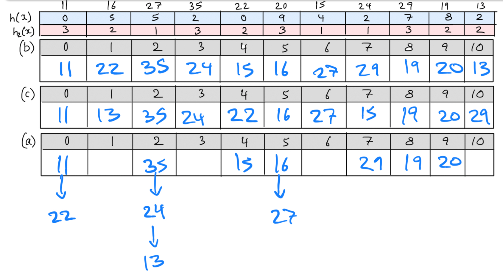

# Hash Tables

1.   Consider this potential hash function:

     ```c
     int hash(char *key, int N) {
        int h = 0;
        char *c;
        for (c = key; *c != '\0'; c++) {
            h = h + *c;
        }
        return h % N;
     }
     ```

     How does this function convert strings to `int`s?

     -   Sums up the ASCII values of all the `char`s in the string and mods it with $N$.

     What are the deficiencies with this function and how can it be improved?

     -   Anagrams with be hashed to the same value despite being different strings, e.g. `hash("abcd") == hash("dcab")` because the sum of all their characters will be equal. We can reduce the likelihood of this by incorporating the position of each character in each string into the hash so that an `a` at the beginning is weighted differently to an `a` at the end of the string.

     ```c
     int hash(char *key, int N) {
        int h = 0;
        char *c;
         int pos = 1;
        for (c = key; *c != '\0'; c++) {
            h = h + (*c) * pos;
             pos++;
        }
        return h % N;
     }
     ```

2.   For a hash table of size $N$ that uses separate chaining for collision resolution, with the chains sorted in ascending order on key value, what are the best case and worst case costs for inserting $k=2N$​ items into the table? Assume that insertion cost is measured in terms of number of key comparisons. What will be average search cost after all the insertions are done?

     Insertion cost for all $k$ items:

     -   Best case: $k/2$ where our hash table looks like this:

         ```
         [1, 2, ..., N-1, N]
          |  |        |,  |
         N+1 N+2 ... k-1  k
         ```

         So inserting the first $k/2$ elements requires $0$ key comparisons as each element is hashed to an empty slot. Inserting the second $k/2$ elements requires $1$ key comparison per-insertion as the hash table is already full but the number of collisions are minimal.

     -   Worst case: $\frac{k(k-1)}{2}$ where everything hashes to the same index and the table looks like this:

         ```
         [1, _, ..., _, _]
          |
          2
          |
         ...
          |
         k-1
          |
          k
         ```

         This is essentially like inserting into an ordered linked list, where the first insertion requires $0$ key comparisons as the slot is empty, the second insertion requires $1$ comparison, the next one requires $2$, and so on until the last element that is inserted is compared with all $k-1$ keys that came before it.

     Average search cost (per-item):

     -   Best case hash table: $1$ key comparisons for the $k/2$ elements that are at the beginning of the chain. $2$ key comparisons for the other $k/2$ elements that are at the end of the chain (each chain is length $2$). So on average we get $(\frac{k}{2}+2\frac{k}{2}) \div k = 3/2$ key comparisons.
     -   Worst case hash table: this is essentially a linear pass through a linked list of size $k$. Sometimes the element we're searching for will be closer to the front of the list, sometimes it'll be near the end, so on average we get $k/2$ key comparisons.

3.   Consider a very small hash table with only 11 entries, and a simple hash function $h(x)=x % 11$. If we start with an empty table and insert the following values in the order shown

     `11  16  27  35  22  20  15  24  29  19  13`

     give the final state of the table for each of the following collision resolution strategies

     1.   separate chaining, with chains in ascending order
     2.   linear probing
     3.   double hashing, with $h2(x)=(x \mod 3)+1$​​

     Note: I didn't keep the seperate chaining lists sorted cause I got lazy but they are usually kept sorted.

     

4.   Both hash tables and balanced search trees (e.g., AVL trees and 2-3-4 trees) are efficient data structures that can be used for the insertion, searching and deletion of key-value pairs. Compare the advantages and disadvantages of each.

     -   Search, insertion and deletion: $O(\log n)$ worst case for AVL trees, $O(1)$ expected time for hash tables ($O(n)$ worst case but the expected time complexity is more representative for a common use case).
     -   Ordered queries: searching for the smallest element, largest element, $kth$ smallest element, etc are done more efficiently with AVL trees because they're ordered. Hash tables are unordered so finding the largest element for example would require a linear scan of all keys.
     -   Memory usage: Given $n$ elements, an AVL tree would allocate one node per element whereas the hashtable allocates some capacity $m$ such that $m >= n$, so for use cases where the number of elements is relatively small, AVL trees may be more memory efficient. However, AVL trees come with the added overhead of storing 2 pointers (each 8 bytes) per node plus additional fields like `height`. Hash tables don't have as much extra overhead, it's usually just an array to store key-value pairs, and 2 integers to keep track of the current size and capacity.

5.   In lectures, we discussed how to solve the famous two-sum problem efficiently using a hash table. Taking inspiration from that, let's see if you can now solve the three-sum problem!

     Here's the problem - given an array of integers and a target sum $S$, determine whether the array contains three integers that sum to $S$. Try to find a solution that is $\mathcal{O}(n^2)$ on average.

     ```c
     bool threeSum(int arr[], int size, int sum) {
         HashTable ht = HashTableNew();
         
         // loop through each element in O(n) time
         for (int i = 0; i < size; i++) {
             int diff = sum - arr[i];
             // check if curr elem can be added to some
             // previous sum to get the target sum in O(1) (expected) time
             if (HashTableContains(ht, diff)) {
                 HashTableFree(ht);
                 return true;
             }
             // add the sum of the curr elem with all previous
             // elems for lookup in future iterations
             for (int j = 0; j < i; j++) {
                 HashTableInsert(ht, arr[i] + arr[j]);
             }
         }
     
         // concede defeat and return
         HashTableFree(ht);
         return false;
     }
     ```

6.   Fun fact: 2521 is a prime number! If a hash table which stores integer keys had 2521 slots and used double hashing for collision resolution, define a suitable secondary hash function $h_2$​ for the table. Briefly comment on what makes it suitable.

     Since 2521 is prime, any value in the range $[1, 2520]$ will be a suitable probe increment as it would be a co-prime. $h_2(x) = x \mod 2520$ gives us values in the range $[0, 2519]$, so we can just add 1 to get our desired range: $h_2(x) = (x \mod 2520) + 1$.

7.   Calls to functions (e.g. some recursive functions) are sometimes very expensive to compute. One often-employed trick when working with such functions is **memoisation**: the first time the function is called with some input, we *cache* this result (i.e. store it somewhere for use later on), and then for subsequent calls to the function with the same input, we consult the cache rather than actually evaluating the call.
     1.   Design an ADT for a memoiser that supports memoisation of an expensive single-argument function.

          ```c
          // External view of the ADT:
          // a call function that's a wrapper around the expensive function
          int call(int x);
          
          // Internal implementation
          // check if the result has already be stored in the hash table
          // only call f(x) if not
          int call(int x) {
              if (HashTableContains(cache, x)) {
                  return HashTableGet(cache, c);
              }
              
              int y = f(x);
              HashTableInsert(cache, x, y);
              return y;
          }
          ```

     2.   One potential problem with memoisation is that the cache's memory usage can grow quite large when the function is called for lots of inputs. This is often solved by limiting the size of the cache and having a policy which can be used to pick entries to remove from the cache to make more room. What are some possible policies you could use? Can you think of how you would actually implement some of these policies?

          -   First-in, first-out (FIFO): create a queue where anytime a new $f(x)$ is computed it goes to the back of the queue. Keep track of the size of the queue and enforce an upperbound such that when the queue is at capacity the element at the head gets dequeued, freeing up space for the new result to be cached.

          -   Least recently used (LRU): keep a timestamp associated with each input. When the hash table is at capacity, find the smallest time stamp and evict the key-value pair associated with it.
          -   Least commonly used: Keep a counter for how many times the function has been called for each $x$. Evict the element that has the smallest count, choose arbitrarily in the case of a tie.